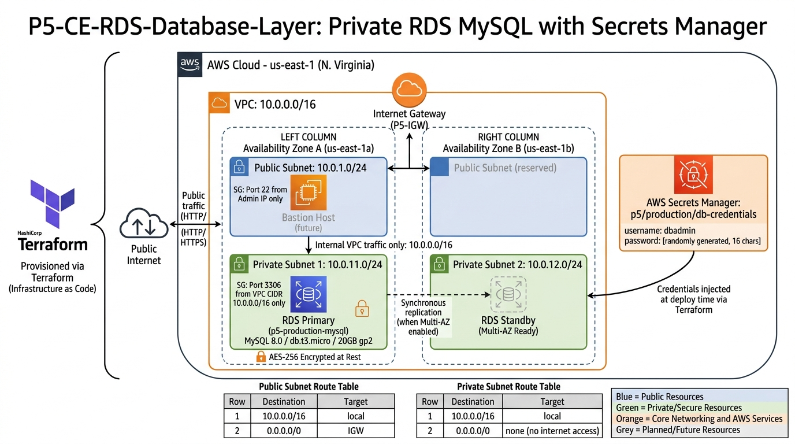
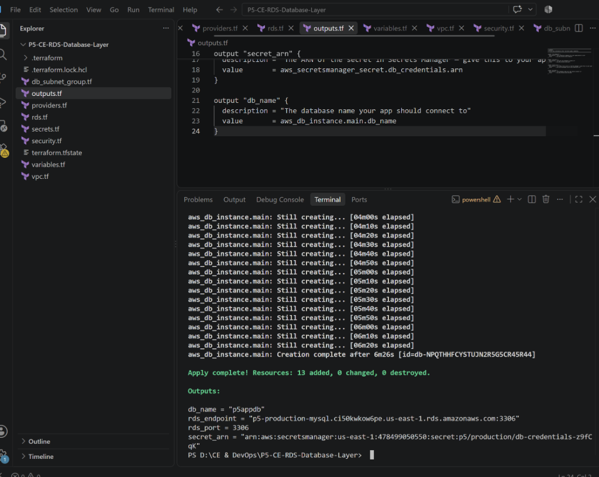
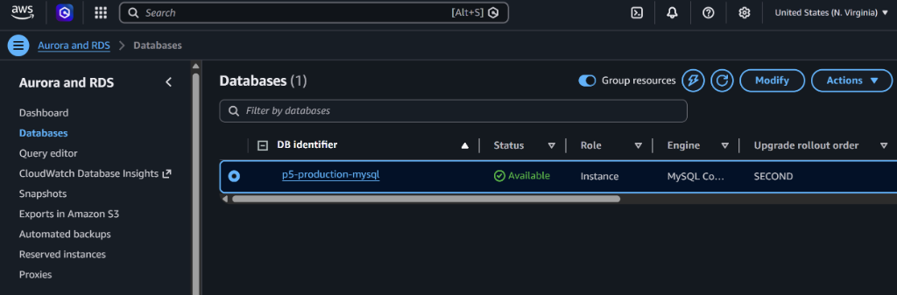

# P5-CE-RDS-Database-Layer

## Overview

This project provisions a production-ready, private MySQL database on AWS using Terraform. It is the fifth project in a Cloud Engineering portfolio series, building on top of a multi-AZ VPC foundation to deliver a fully managed relational database layer with secure credential handling and no internet exposure.

The infrastructure follows the same patterns used in real-world production deployments: the database sits inside private subnets with no public IP, credentials are generated randomly and stored in AWS Secrets Manager so they never appear in code or version control, and the networking is designed to be extended to Multi-AZ failover by flipping a single variable.

This is not a tutorial setup. The configuration choices made here reflect what a senior engineer would deliver to a client who needs a database that is secure, auditable, and ready to scale.

## Architecture

The database lives entirely within private subnets and is never directly reachable from the internet. All traffic to the RDS instance must originate from within the VPC CIDR range. Credentials are injected at deploy time by Terraform from Secrets Manager and are never stored in any configuration file.

## Key Features

* Private RDS MySQL 8.0 instance on db.t3.micro (AWS Free Tier eligible)
* Cryptographically random 16-character database password generated at deploy time
* Password stored as a structured JSON secret in AWS Secrets Manager, never in code
* Storage encrypted at rest using AES-256 via AWS-managed keys
* DB Subnet Group spanning two Availability Zones, ready for Multi-AZ promotion
* Security Group restricts MySQL access to port 3306 from within the VPC CIDR only
* Automated daily backups with a 7-day retention window
* Multi-AZ toggle controlled by a single variable for easy environment promotion
* All resources tagged consistently using provider-level default tags

## File Structure

`
P5-CE-RDS-Database-Layer/
|-- providers.tf          AWS and Random provider configuration with default tags
|-- variables.tf          All configurable inputs with sensible defaults
|-- vpc.tf                VPC, subnets, internet gateway, and route tables
|-- security.tf           Security group restricting inbound access to port 3306
|-- db_subnet_group.tf    DB Subnet Group spanning two private subnets across AZs
|-- secrets.tf            Random password generation and Secrets Manager storage
|-- rds.tf                RDS MySQL instance with backup, encryption, and tagging
|-- outputs.tf            Prints the RDS endpoint, port, secret ARN, and DB name
|-- assets/               Architecture diagram and deployment screenshots
`

## Prerequisites

* Terraform v1.5 or later installed and available on your PATH
* AWS CLI v2 installed and configured with credentials that have sufficient IAM permissions
* An AWS account with the RDS, VPC, Secrets Manager, and IAM services available in us-east-1
* Git installed locally

To verify your setup before deploying:

`ash
terraform --version
aws sts get-caller-identity
`

## Deployment

Clone the repository and navigate into the project folder:

`ash
git clone https://github.com/adeliusa486/P5-CE-RDS-Database-Layer.git
cd P5-CE-RDS-Database-Layer
`

Initialize Terraform to download the required providers:

`ash
terraform init
`

Review the execution plan before applying anything to your AWS account:

`ash
terraform plan
`

Deploy the infrastructure. This step will take approximately 6 to 10 minutes because RDS provisioning involves allocating storage, installing the database engine, and running first-boot configuration:

`ash
terraform apply
`

When the apply completes, Terraform will print the outputs directly to your terminal:

`
db_name      = "p5appdb"
rds_endpoint = "p5-production-mysql.xxxxxxxx.us-east-1.rds.amazonaws.com:3306"
rds_port     = 3306
secret_arn   = "arn:aws:secretsmanager:us-east-1:xxxxxxxxxxxx:secret:p5/production/db-credentials"
`

The RDS endpoint is what your application uses to connect. The secret ARN is what your application uses to retrieve the credentials from Secrets Manager at runtime.

## Proof of Deployment

Terraform apply completed successfully with 13 resources added:

RDS instance confirmed available in the AWS Console:

## Cleanup

This infrastructure incurs charges while running. To destroy all resources cleanly and avoid unexpected costs, run:

`ash
terraform destroy
`

Terraform will deprovision every resource it created in the correct dependency order. The RDS instance deletion takes approximately 3 to 5 minutes. Confirm by typing yes when prompted.

Note: if you ever enable deletion_protection on the RDS instance for a production deployment, you will need to set it to false first before terraform destroy will succeed.

## Configuration Reference

The following variables can be overridden to customize the deployment:

| Variable | Default | Description |
|---|---|---|
| vpc_cidr | 10.0.0.0/16 | IP range for the entire VPC |
| db_name | p5appdb | Initial database name created inside RDS |
| db_username | dbadmin | Master username for the RDS instance |
| db_instance_class | db.t3.micro | RDS instance size |
| db_engine_version | 8.0 | MySQL version |
| db_allocated_storage | 20 | Storage in GB |
| multi_az | false | Enable Multi-AZ failover for high availability |
